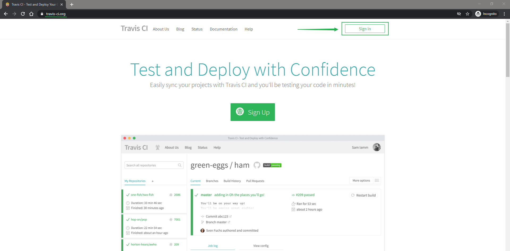
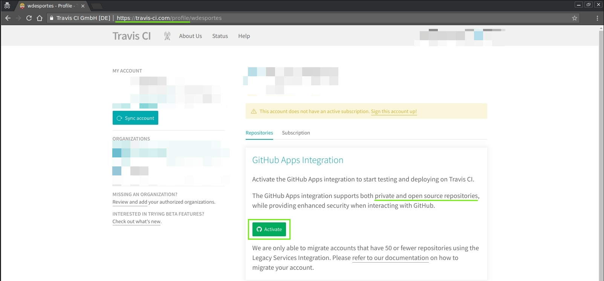
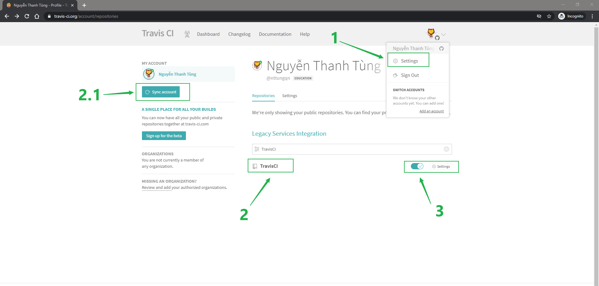
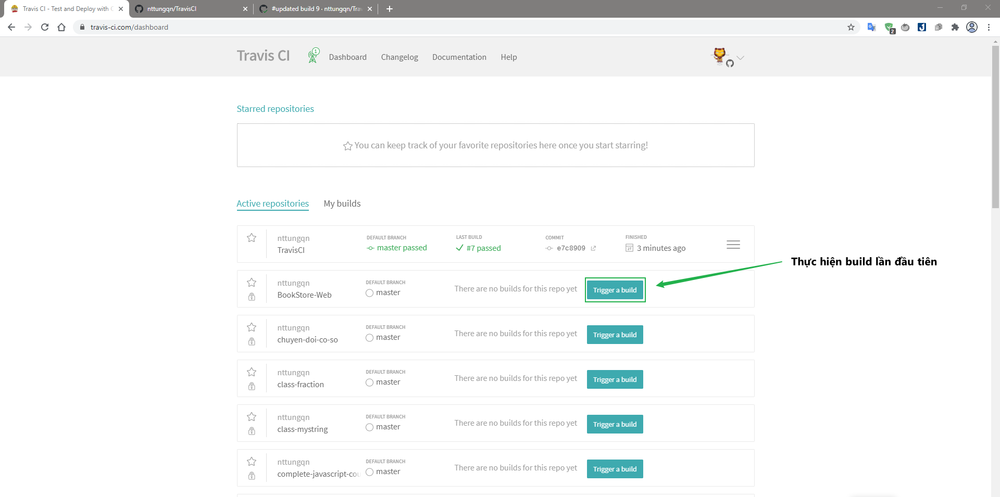
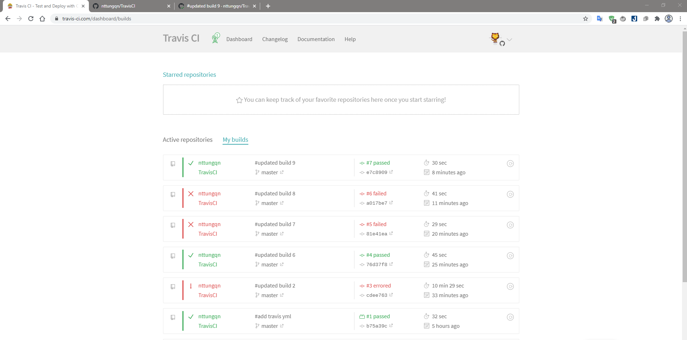
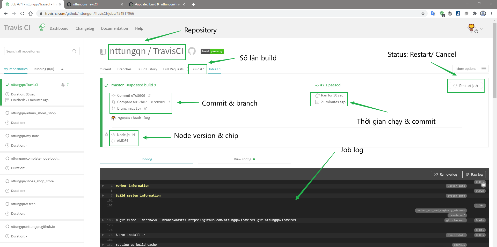
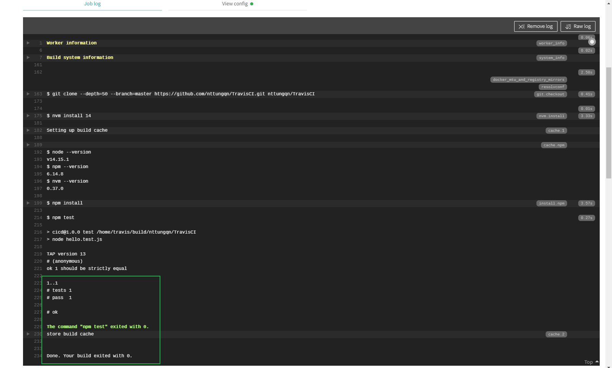
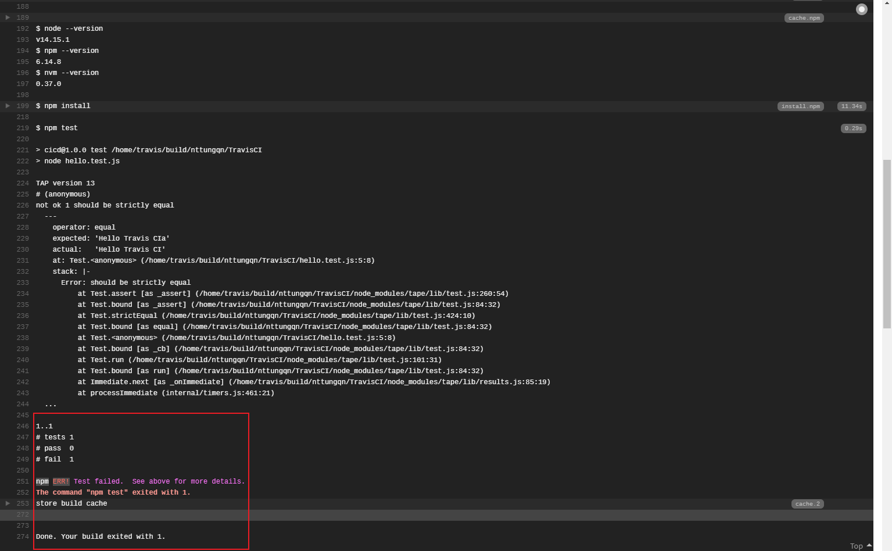

# Travis CI

## Các bước thực hiện

1. Vào trang **Travis CI** với đường dẫn [https://travis-ci.org/]([Travis CI - Test and Deploy Your Code with Confidence](https://travis-ci.org/))



2. Xác thực kết nối đến **Github**
   


3. Cấp quyền *active* cho **Travis CI** để lấy thông tin các repositories từ **Github** về




4. Chọn repository để test, ở đây mình chọn **TravisCI**



5. Thực hiện build lần đầu
   


6. Lịch sử những lần build


7. Dashboard build
   


8. Job log
   
   - Pass
     
   
   
   - Fail
     
   

# TravisCI Project

1. Cấu trúc thư mục

```
TravisCI
|_.travis.yml
|_hello.js
|_package.json
|_hello.test.js
|_other_files
```

2. Tạo file `.travis.yml` 
   
```json
language: node_js
node_js:
   - "node"
env:
- MY_VAR=EverythingYouWant
- NODE_ENV=TEST
...
```
   
   - Ở đây mình dùng nodejs nên set language là ngôn ngữ **node_js**
   
   - Dòng tiếp theo là version thì tùy vào phiên bản bạn muốn sử dụng mà có thể điền số tương ứng với phiên bản, **"node"** có nghĩa là đang sử dụng bản nodejs mới nhất
   
   - Tiếp theo **env** là set các biến môi trường khi cần thiết
   
   - Ngoài ra ta có thể cấu hình nhiều thứ khác nữa như **script, cache,..** mặc định khi test nó chạy lệnh **npm test**
     
     
